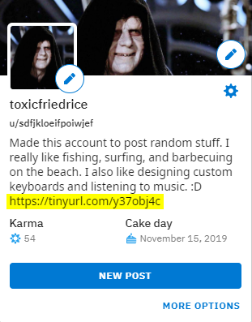
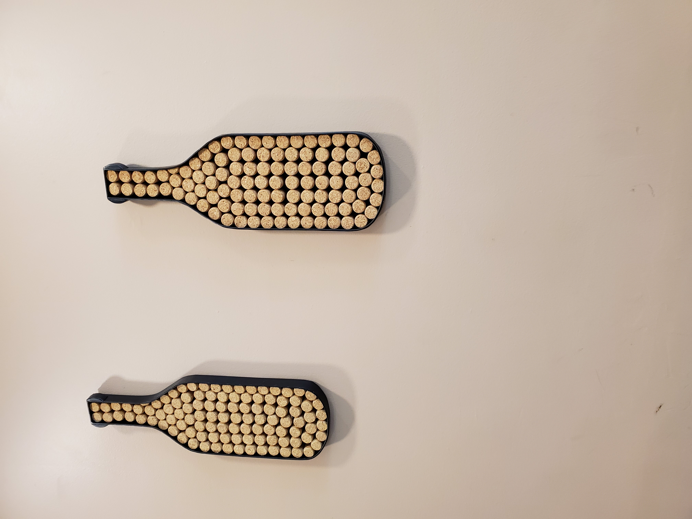
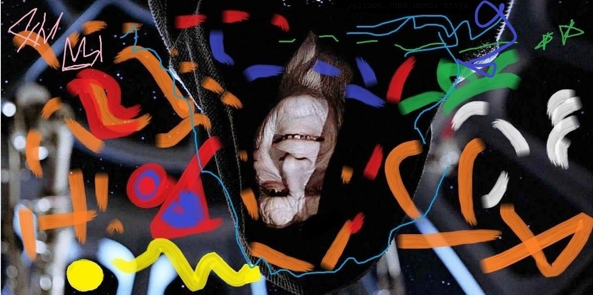

# Rowan University's Cybersecurity Club 2020 Discord CTF

## CTF Creator: [Tapan Soni](https://github.com/TapanSoni)

## Challenge 1 - Day 1: Monday

### Initially given synopsis

They say a picture is worth a thousand words. I want to say that this picture is worth about 10, 000 words. This is the iconic and legendary nasa space shuttle seen here Booking it to space. This Particular image is of the Space shuttle on its 27th mission. A couple of fun facts about the space shuttle:

1) over the course of its Tenure, the space shuttle has sent over 3 million pounds of cargo into space!
2) the Entire length of the space shuttle is 183 feet
3) columbia was the first space shuttle to be delivered to the kennedy space center in march of 1979
4) the Guiding computers for the space shuttle were made by ibm
5) the longest that the space shuttle has stayed in orbit during A single mission is 17.5 days during in november of 1996
6) the smallest crew to fly the space suttle was 2 - during the first few missions -- imagine the pressure on the New engines during the first test!
7) the space shuttle is designed to reach Orbits randing from about 185 kilometers to 643 kilometers high!

The space shuttle program has transformed the direction of space travel forever. It has transformed thousands of lives and given us a new direction to venture into when looking up at the STARS.

### Initially given files

|shuttle.png|
|-----------|
||

### Solution

By looking at the synopsis you can see certain words capatilized. Words that are unnecessarily capatilized are:

01. Booking
02. Particular
03. Space
04. Tenure
05. Entire
06. Guiding
07. A
08. New
09. Orbits
10. STARS

When you look at the capatilized letters of the words - they spell ```BPSTEGANO``` and ```STARS```

[BPStegano](https://github.com/TapanSoni/BPStegano) is the image steganography tool written by Tapan Soni and his group for his Graduate Cryptography class during the Fall of 2019.

BPStegano uses AES-128 encryption a custom LSB random pixel algorithm hiding to hide raw strings and any type of file inside images.

Download and run BPStegano on the shuttle.png image. The password is ```STARS ```.

BPStegano will decode the image and save the contents of the image into a ```HIDDEN_DATA``` folder.

Print out the ```Day1Code.txt``` file to see the code of Day 1.

|Output of BPStegano|
|-----------|
||

|Contents of the HIDDEN_DATA folder|
|-----------|
||

### Code

```Day 1's code: CDCTF{pushflagpackets}```

## Challenge 2 - Day 2: Tuesday

### Initially given synopsis

I found this weird user when I was browsing reddit -> u/sdfjkloeifpoiwkef - They were posting a lot of pictures. I don't know if the pictures mean anything. I couldn't see anything out of the ordinary.

### Initially given files

None.

### Solution

When you search for ```u/sdfjkloeifpoiwkef``` on Reddit, you will see their profile. There are a bunch of images that are posted on the profile by the user. They are there to throw you off.

Look at the user description box under the profile image and you will see a link there. The link is ```https://gofile.io/d/MgWhQ5``` -- it is a GoFile link to an image.

|Location of the GoFile link|
|-----------|
||

|Image at the GoFile link|
|-----------|
||

Now, if you try and perform steganalysis on the image, nothing is going to come of it.
The code of the day is hidden in the EXIF data of the image.

Well, I guess rummaging through EXIF data is a form of steganalysis.

Anyways (on Windows), right click on the image > Properties > Details > Comments

Open the comments section.

This is the content of the comments section:

```
This is a picture of a cork bottle. The cork is usually used to cap off
wine bottles but in this case, they made bottles out of corks.


*What is this*??
43 44 43 54 46 7b 73 68 61 32 35 36 7d
```

The encoded phrase at the bottom is the flag. It is in hexadecimal and needs to be converted to its character equivalent.

I used this converter to convert hex numbers to ASCII characters - https://www.rapidtables.com/convert/number/hex-to-ascii.html


### Code

```Day 2's code: CDCTF{sha256}```

## Challenge 3 - Day 3: Wednesday

### Initially given synopsis

I've hidden today's code in the server somewhere. Look everywhere and at everything.

### Initially given files

None.

### Solution

In the ```general-ctf``` channel, when you scroll up a little bit, you will see a message by Tapan Soni saying ```Day 3 -> CDCTF{This is not the code - you need to find the code hidden throughout the server}```

This is the first clue. Well, a message, not really a clue.

|Fragment #| Code fragment| Location|
|-|-|-|
|1/4|c|In the ```general-sparx``` channel description under the ```SPARX``` category|
|2/4|h|In the ```project-managers``` channel description under the ```RFID``` category|
|3/4|r|In the ```announcements``` channel under the ```PUBLIC DOMAIN``` category. Look at the emoji reactions of the recent announcements|
|4/4|(|Set as Tapan Soni's status|

### Code

```Day 3's code: CDCTF{chr(}```

## Challenge 4 - Day 4: Thursday

### Initilly given synopsis

In progress

### Initially given files

[Wireshark Packet Dump](Files/day4.pcapng)

### Solution

```python
# Rowan Cybersecurity Club Discord CTF - Day 4 Code
# Written by Tapan Soni
# THIS IS MY VERSION OF THE SOLUTION - YOUR SOLUTION MAY (PROBABLY WILL) DEFER
# 6/25/2020

# Import Scapy and hashlib
# Scapy for reading in the packets from the PCAP file and working with packet values
# Hashlib for the SHA256 hashing algorithm
from scapy.all import *
import hashlib

# Initialize the SHA256 hashing algorithm
# [DAY 2 CODE]
# sha256
h = hashlib.sha256()

# Read in the packets from the PCAP file
packets = rdpcap("day4.pcapng")

# a -> Array to hold the decoded letters in the final flag - character array
# s -> Holds the 8-bit binary string that will be turned into a character - string
a = []
s = ""

# srcIP -> Source IP address of the packet - string
# dstIP -> Destination IP address of the packet - string
# srcPort -> Source port number of the packet - int
# dstPort -> Destination port number of the packet - int
# seqNum -> Sequence number of the packet - int
# data -> Data of the packet - bytes
srcIP = ""
dstIP = ""
srcPort = 0
dstPort = 0
seqNum = 0
data = b""

# Check every packet in the packet array
for packet in packets:
    
    # Check if the packet is an IPv4 packet
    if IP in packet:
        
        # Check if a TCP layer exists
        # If the TCP layer exists - then TCP flags can be set
        if TCP in packet:

            # Check if the TCP PSH (push) flag is set (enabled)
            # [DAY 1 CODE]
            # if (pushflagpacket) in p -> Meaning if the push flag is set (enabled)
            if (packet[TCP].flags == 8):
                
                # Get the srcIP, dstIP, srcPort, dstPort, seqNum, and data
                srcIP = packet[IP].src
                dstIP = packet[IP].dst
                srcPort = packet[TCP].sport
                dstPort = packet[TCP].dport
                seqNum = packet[TCP].seq
                data = packet[Raw].load
                
                # Concatenate the data into one giant string - everything in bytes
                dataToHash = srcIP.encode() + dstIP.encode() + str(srcPort).encode() + \
                    str(dstPort).encode() + str(seqNum).encode() + data
                
                # Hash the data
                h.update(dataToHash)
                
                # Get the hexadecimal digest -> convert to a binary hash
                hexDigest = h.hexdigest()
                binDigest = bin(int(hexDigest, 16))[2:]
                
                # Get the last 8 bits (1 byte) of the binary hash
                last8Bits = binDigest[-8:]
                
                # Convert the 8 bits to a character and add it to the array to print later
                # letter = [DAY 3 CODE]int(last8Bits, 2)
                # letter = chr(int(last8Bits, 2))
                letter = chr(int(last8Bits, 2))
                a.append(letter)

    # Delete the hash object and create a new one for every iteration
    # BECAUSE -> the .update() function concatenates the input paramater 
    # to whatever the previous parameter was. For example -> If I call
    # h.update("Hello") 10 times, I'm going to get a different hash everytime.
    
    # Not really a problem if on both the server & client side it is done that
    # way, but for large messages, the buffer can blow up. NOT GOOD!
    # And it's bad practice - calling h.update("Hello") 9 times shouldn't give
    # me a different hash than the first time I called it.
    
    # To solve that problem -> Delete and create a new hashlib.sha256() object h.
    # This "bug" took me about 15 hours to debug and figure out what was going on
    # Didn't expect the update() function to work like this
    del h
    h = hashlib.sha256()

# Print out the array to see the final flag
# end = "" just keeps it all on one line - easier to read
print()
for k in a:
    print(k, end = "")

print()
```

The output of this Python program is the code for day 4.

### Code

```Day 4's code: cdctf[y917tnof]```

## Challenge 5 - Day 5: Friday

### Initially given synopsis

This might be helpful - https://tinyurl.com/[DAY 4 CODE]

### Initially given files

None.

### Solution

When you go to the tinyurl link, it redirects you to a Google Form.

In the Google Form there is an image of Emperor Palpatine with a bunch of stuff on his face.


You're going to have make sure that your screen brightness is all the way up and you're not using a blue light filter.

In the bottom left of the image - in that dark spot to the right of the blue markings, there is a URL.

The URL is ```elvis.rowan.edu/~sonit9/```.

I tried my best to make it as visible as possible while keeping it hidden.

|Image in the Google Form|
||
|Link location|
||
|URL|
||

### Code

## Conclusion